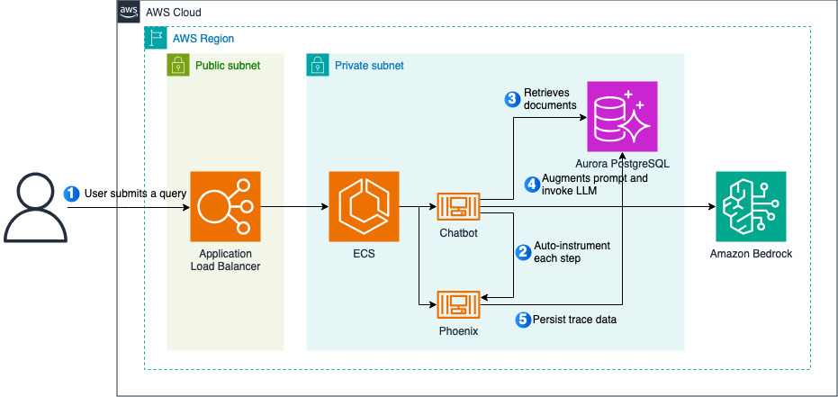

# Enhancing Generative AI Chatbot Observability: Debugging Conversations with Arize Phoenix



This repository contains a step-by-step guide for setting up tracing for a chatbot using Arize Phoenix, an open-source LLM observability solution that you can self-host in your own environment and use it for auto-instrumentation of traces. The concepts in this respository are applicable to any situation where you want to setup LLM observerability. However, note that the configuration we used for resources in this post, such as Amazon Elastic Load Balancer (Amazon ELB), Amazon Elastic Container Registry (Amazon ECR), etc., are not suitable for production use as-is. You would need a thorough security review if you plan to take the concepts to your production environment.

## Getting Started
Clone the git repository into a folder. For example:

```
git clone https://github.com/seanlee10/llm-observability-with-arize-phoenix
```

### Step 1. Build Gradio Image

```
cd /gradio
docker build -t phoenix-demo-gradio .
```

### Step 2. Provision Resources

```
cd /infra
cdk deploy
```

### Step 3. Verify 


### Step 4. Clean Up

```
cdk destroy
```

## Feedback

Create an issue [here](https://github.com/awslabs/automated-security-helper/issues).

## Contributing

See [CONTRIBUTING](CONTRIBUTING.md#contributing-guidelines) for information on how to contribute to this project.


## Security

See [CONTRIBUTING](CONTRIBUTING.md#security-issue-notifications) for more information.

## License

This library is licensed under the MIT-0 License. See the LICENSE file.

